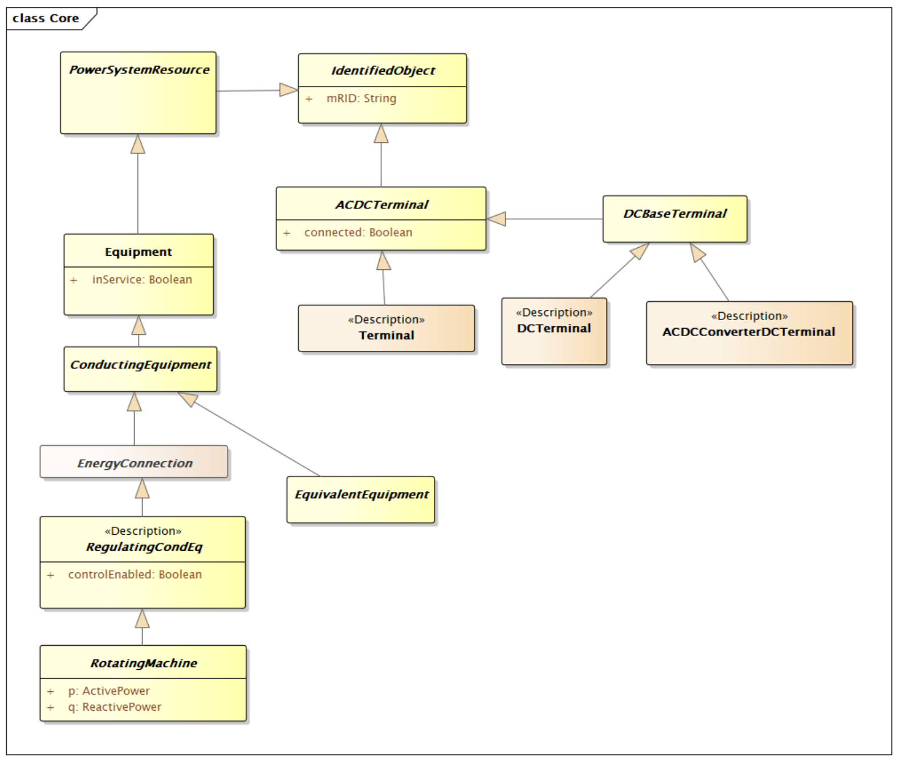

# Steady State Hypothesis Profile

A steady state hypothesis dataset which conforms to the IEC 61970-456 steady
state hypothesis profile contains all objects required to exchange input
parameters to be able to perform load flow simulations. Due to the nature of
the SSH profile, all objects in a Steady State Hypothesis instance file should
have persistent mRIDs.

